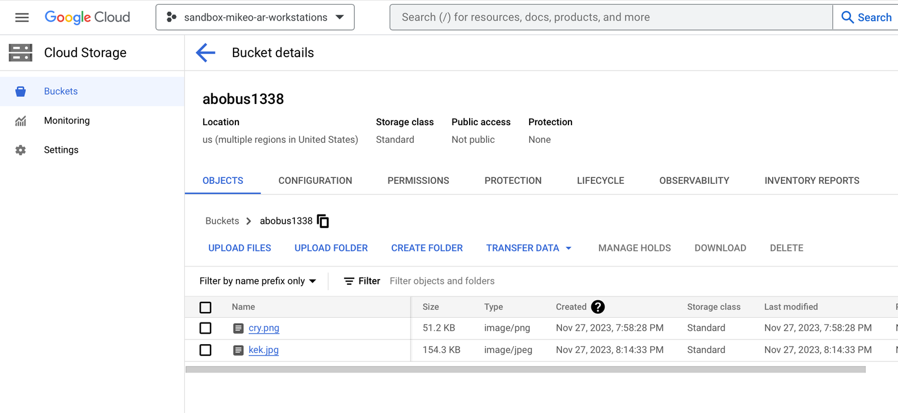
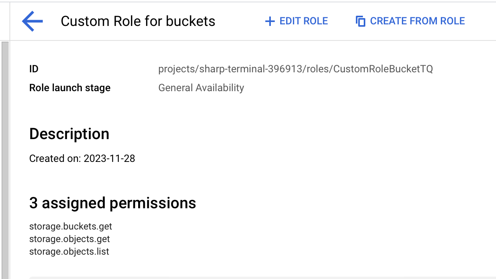
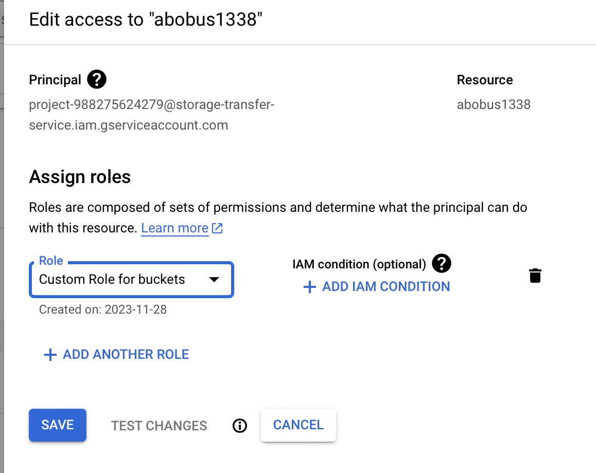
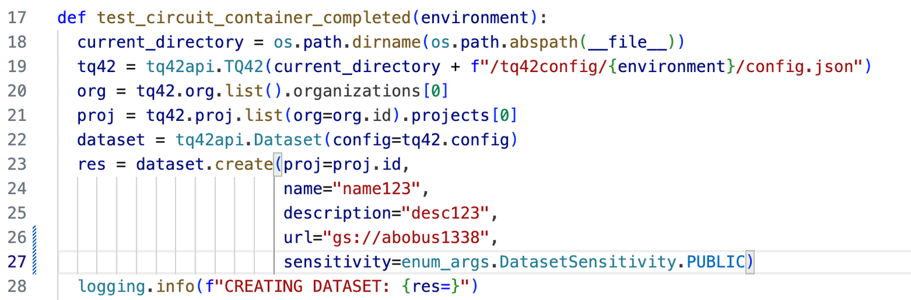
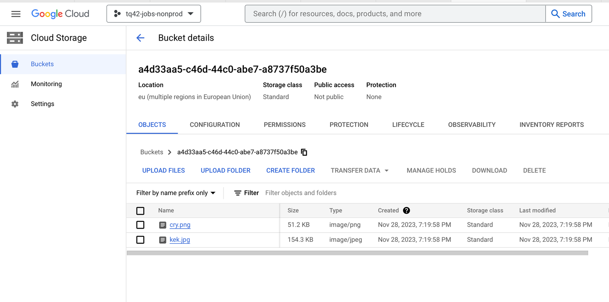

# Instructions for Creating a GCP Dataset for TQ42

## Initial Setup Requirements

1. **URI/URL Format**:
   - Format: `[storage_type]://[bucket_name]`.
   - Examples:
     - Google Cloud Storage: `gs://bucket_name`
     - AWS S3: `s3://aws_bucket`
     - Azure Storage: `az://another_bucket`.

2. **GCP Service Account Name**:
   - Format: `project-[PROJECT_NUMBER]@storage-transfer-service.iam.gserviceaccount.com`.
   - Current Account: `project-988275624279@storage-transfer-service.iam.gserviceaccount.com`.
   - Note: This may change in the future. A single service account is shared across all customers.

## Sample Upload Workflow

1. **Create and Upload to Bucket**:
   - The user creates a bucket in their cloud environment and uploads the required files.

   

2. **Create a Custom Role**:
   - The user creates a new custom role using a provided template with the necessary permissions.

   

3. **Edit Bucket Access**:
   - The user returns to their bucket to edit access settings.
   - Grant access to the service account: `project-988275624279@storage-transfer-service.iam.gserviceaccount.com`.
   - Assign the newly created role from step 2 to this service account.

   

4. **Run tq42 SDK for Storage and Data Transfer**:
   - The user runs the tq42 SDK to create new storage and transfer data.
   - Note: The URL format is `gs://[id_of_bucket]`.

   

5. **Finalize Data Transfer**:
   - After the code execution, a new bucket with a random ID is created, and files are transferred into it.

   
