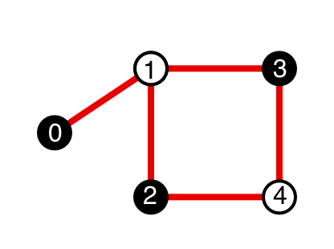

# Example problem: Max-cut

  

Let us consider the simple unweighted max-cut problem, depicted in the figure. The goal of the unweighted max-cut problem is to separate vertices into two groups so that the number of edges between the two groups is maximized. In the figure, we have highlighted the solution where the white vertices belong to one group and the black vertices belong to another. This separation constitutes a solution because all edges connect vertices from different groups, meaning no additional edge can be added without violating the solution.  

## Step 1: Setup the QuEnc Experiment
To perform an optimization using QuEnc, begin by defining the QUBO problem using a matrix. In this example the matrix is
```python
qubo = [[0, 1, 0, 0, 0],
        [0, 0, 1, 1, 0],
        [0, 0, 0, 0, 1],
        [0, 0, 0, 0, 1],
        [0, 0, 0, 0, 0]]
```

The matrix is five by five, because there are five edges in the graph. In the parameters of a QuEnc experiment run expects the QUBO matrix to be flattened list of floating point number. With `numpy`, this can be done by

```
qubo = np.array(qubo).reshape(-1)
qubo = qubo.tolist()
```

Also choose the number of layers in the quantum circuit, the number of optimization steps, and the velocity. Usually the best choice for optimizer will be `ADAM`.

```python
parameters = {
	'parameters': {
    	'qubo': [0, 1, 0, 0, 0, 0, 0, 1, 1, 0, 0, 0, 0, 0, 1, 0, 0, 0, 0, 1, 0, 0, 0, 0, 0],  
    	'number_layers': 5,
    	'steps': 25,
    	'velocity': 0.05,
    	'optimizer': 'ADAM'
	},
	'inputs': {}
}

with TQ42Client() as client:
	quenc_run = ExperimentRun.create(
    	client=client,
    	algorithm='QUENC',
        version='0.4.0',
    	experiment_id=selector.experiment.id,
    	compute=HardwareProto.SMALL,
    	parameters=parameters
	)

quenc_result = quenc_run.poll()
```

This code snippet initiates a QuEnc experiment on a small hardware configuration, generating a quantum circuit optimized to approximate the solution to the specified QUBO.

## Step 2: Sample from the Resulting Circuit
Once the circuit is created, sample it using a quantum simulator to gather a distribution of possible solutions.
Note: For the 'backend' parameter of CIRCUIT_RUN, you can choose between the following:

Simulators:
1. CIRQ_SIMULATOR
2. QISKIT_SIMULATOR
3. CIRQ_SIMULATOR

Actual QPUs:
1. IBM

```python
circuit_storage_id = quenc_result.data.result.outcome['outputs']['circuit']['storage_id']

parameters = {
	'parameters': {
    	'shots': 500,
    	'backend': 'CIRQ_SIMULATOR'
	},
	'inputs': {
    	'circuit': {'storage_id': circuit_storage_id}
	}
}

with TQ42Client() as client:
	run = ExperimentRun.create(
    	client=client,
    	algorithm='CIRCUIT_RUN',
        version='0.2.0',
    	experiment_id=selector.experiment.id,
    	compute=HardwareProto.SMALL,
    	parameters=parameters
	)

circuit_run_result = run.poll()
```

This code runs the quantum circuit 500 times on a simulator, producing a set of output states that represent potential solutions to the QUBO.

## Step 3: Convert and Analyze Samples
Convert the quantum samples into a binary integer representation and estimate the probability distribution over these states.

```python
from collections import Counter

def sample_to_integer(sample):
	n = 0
	for qq_key, bit in sample.items():
    	if bit:
        	exponent = int(qq_key.replace("qq(", "").replace(")", ""))
        	n += 1 << exponent
	return n

counter = Counter([sample_to_integer(sample) for sample in circuit_run_samples])

state_size = 2 ** 4

distribution = [0.0] * state_size

for n, count in counter.items():
	distribution[n] = count / len(circuit_run_samples)
```

This function converts the sampled quantum states into integers, counts their occurrences, and computes a probability distribution.

## Step 4: Interpret the Results
Finally, interpret the distribution to determine the most likely solution to the QUBO problem.

```python
solution = [distribution[2*i] < distribution[2*i+1] for i in range(state_size // 2)]
print(solution)
```

This code compares the distribution of even and odd integers to identify which configuration of qubits is most likely to be the optimal solution.

