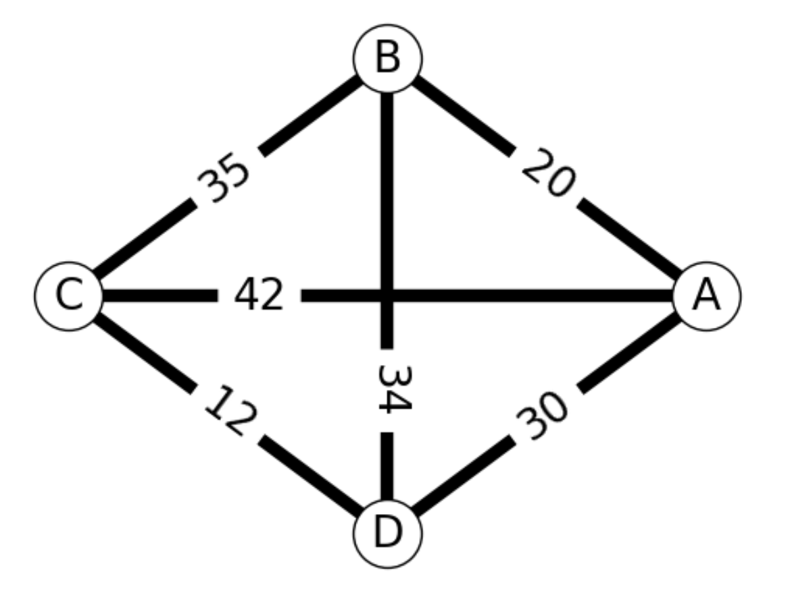

# Best Use Cases & Applicability

## Best Use Cases: Overview
### Traveling Salesman Problem or Vehicle Routing Problem
In this case, the problem can be specified as a linear or quadratic function, in which case TetraOpt will find a good initial solution, which another specialized optimizer can then refine.

### Hyperparameter Optimization
This is the process of choosing a set of optimal hyperparameters for a learning algorithm. This is a true black-box function whose solution depends on the data set for training, and the basic underlying neural net architecture. The objective function will be accuracy, loss, or other validation metrics for a machine learning problem, depending on a data set.

## Example Application: Traveling Salesman Problem
The Traveling Salesman Problem (TSP) is a well-known combinatorial optimization problem in mathematics and computer science. It is named after the metaphorical scenario of a salesman who wants to visit a given set of cities and return to the starting city, while minimizing the total distance traveled.

Given a list of cities and the distances between each pair of cities, the goal is to find the shortest possible route that visits each city exactly once and returns to the starting city. The distances between cities are typically represented by a matrix or a graph.

The TSP is classified as an NP-hard problem, which means that there is no known efficient algorithm that can solve it for large problem sizes in a reasonable amount of time. As the number of cities increases, the number of possible routes grows exponentially, making an exhaustive search impractical. Therefore, researchers and practitioners have developed various heuristic and approximation algorithms to find good solutions that are close to the optimal solution.

The TSP has numerous real-world applications, such as route optimization in logistics, neural network search (architecture / shape optimization), DNA sequencing, molecular dynamics (molecular docking), and network routing. It serves as a benchmark problem for testing the efficiency of optimization algorithms and has been extensively studied in the field of computational complexity theory.

### Sample Data
The data to find the problem is distances traveled in a network. This can be represented in a labeled graph like this:



_Image courtesy of Wikipedia_

To create a distance matrix from the graph above, you must create a 4x4 matrix. This can be done with an array, where the diagonal is all zeros, since it represents the distance from the city to itself. 

To create the matrix, follow the structure below to convert the grid into code.

1. Record the distances between the first city (A) and each other city (A, B, C, and D):

    A to A = 0
    
    A to B = 20
    
    A to C = 42
    
    A to D = 30 

```json
[0, 20, 42, 30]
```

2. Record the distances between the second city (B) and each other city (A, B, C, and D):

    B to A = 20
    
    B to B = 0
    
    B to C = 35
    
    B to D = 34 

```json
[20, 0, 35, 34]
```

3. Record the distances between the third city (C) and each other city (A, B, C, and D):

    C to A = 42
    
    C to B = 35
    
    C to C = 0
    
    C to D = 12 

```json
[42, 35, 0, 12]
```

4. Record the distances between the fourth city (D) and each other city (A, B, C, and D):

    D to A = 30
    
    D to B = 34
    
    D to C = 12
    
    D to D = 0

```json
[30, 34, 12, 0]
```


Your final input value will include each of the individual elements mapped above:

```python
import numpy as np
d = np.array([[0, 20, 42, 30],[20, 0, 35, 34], [42, 35, 0, 12], [30, 34, 12, 0]])
```

Based on those inputs, your distance matrix output should look like this:
```python
array([[ 0, 20, 42, 30],
       [20,  0, 35, 34],
       [42, 35,  0, 12],
       [30, 34, 12,  0]])
```

Your objective function URL you provide in the sample code will contain the distance matrix.

### Sample Code

```python
from tq42.client import TQ42Client
from tq42.experiment_run import ExperimentRun
from tq42.compute import HardwareProto
from tq42.algorithm import AlgorithmProto

parameters = {
   "parameters": {
      "dimensionality": 10,
      "iteration_number": 1,
      "maximalRank": 3,
      "points_number": 1,
      "quantization": True,
      "tolerance": 3.9997,
      "lower_limits": [0, 0, 0, 0, 0, 0, 0, 0, 0, 0],
      "upper_limits": [9, 9, 9, 9, 9, 9, 9, 9, 9, 9],
      "grid": [10, 10, 10, 10, 10, 10, 10, 10, 10, 10],
      "objective_function": "http://34.147.69.98:8000/func_eval/eval",
      "seed": 2,
      "device": "CPU",
      "start_points": [2, 3, 4, 2, 5, 6, 4, 7, 8, 9],
      "precision": "float64",
      "point": "float64"
   },
   "inputs": {}
}

with TQ42Client() as client:
   run = ExperimentRun.create(
      client=client,
      algorithm=AlgorithmProto.TETRA_OPT,
      exp="EXP_ID",
      compute=HardwareProto.SMALL,
      parameters=parameters,
   )
```

See Parameters & Hyperparameters for an explanation of the parameters.
